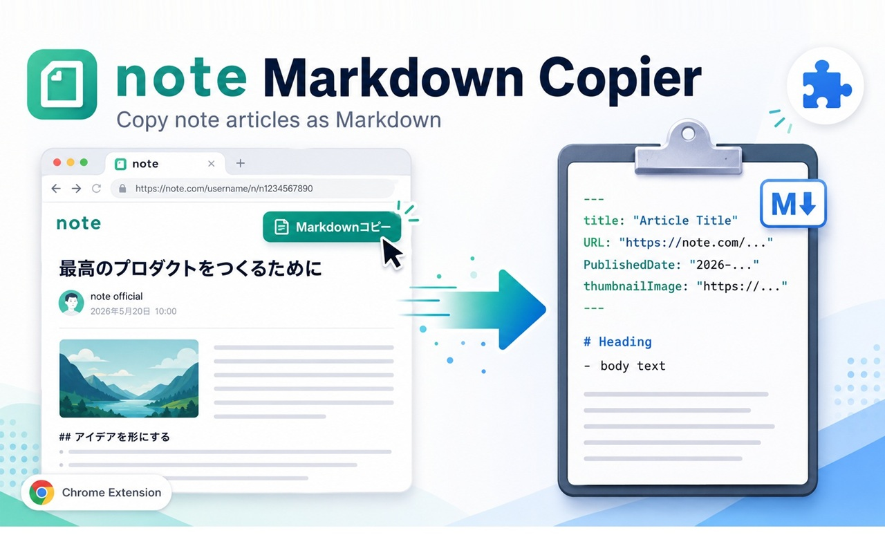

# note記事Markdownコピー



noteの記事ページに「Markdownコピー」ボタンを追加するChrome拡張です。表示中の記事タイトル、メタ情報、見出し画像、記事本文をMarkdownとしてクリップボードへコピーします。

AIに記事内容を参考情報として渡すために、note記事の本文を手早くMarkdown化する用途を想定しています。

## Status

- Chrome Web Store: 公開準備中
- 現在の導入方法: パッケージ化されていない拡張機能として手動インストール
- License: [MIT](LICENSE)

## Features

- `https://note.com/*/n/*` の記事ページで動作
- タイトル下のスキボタン横に「Markdownコピー」ボタンを表示
- 記事タイトル、URL、公開日時、見出し画像をフロントマターに出力
- 記事本文をフロントマターとは分けてMarkdown化
- 本文中の画像を ``、リンクを `[text](url)` として出力
- ヘッダー、検索窓、フッター、タグ、著者プロフィール、応援UIなどの記事外要素を除外
- 外部サーバーへの送信、永続保存、トラッキングなし

## Installation

Chrome Web Store公開までは、次の手順で手動インストールしてください。

1. このリポジトリをダウンロードまたはcloneします。
2. Chromeで `chrome://extensions/` を開きます。
3. 右上の「デベロッパー モード」を有効にします。
4. 「パッケージ化されていない拡張機能を読み込む」を押します。
5. このリポジトリのフォルダを選択します。
6. `https://note.com/*/n/*` の記事ページを開くと、タイトル下のスキボタン横に「Markdownコピー」ボタンが表示されます。

## Usage

1. noteの記事ページを開きます。
2. タイトル下の「Markdownコピー」ボタンを押します。
3. クリップボードにMarkdownがコピーされます。
4. AIチャット、メモ、Markdownエディタなどに貼り付けて使います。

コピーされるMarkdownの先頭には、記事メタ情報のYAMLフロントマターが入ります。

```markdown
---
title: "記事タイトル"
URL: "https://note.com/..."
PublishedDate: "公開日時"
thumbnailImage: "https://..."
---

ここから記事本文が続きます。
```

本文には、タイトル、URL、公開日時、見出し画像は含めません。

## Scope

- 対象ページは `https://note.com/*/n/*` の記事ページです。
- コピー対象は、現在ブラウザ上で表示できている記事本文です。
- 有料・非公開などで画面に表示されていない本文は取得しません。
- noteのDOM構造変更により、抽出結果が変わる可能性があります。

## Permissions

`manifest.json` では次の権限を使います。

- `clipboardWrite`: ボタンを押したときにMarkdownをクリップボードへ書き込むため。

content scriptの対象は `https://note.com/*/n/*` のみです。

## Privacy

この拡張は、閲覧中のnote記事ページのDOMをブラウザ内で読み取り、Markdownをクリップボードへコピーします。外部サーバーへの送信、分析、トラッキング、永続保存は行いません。

詳しくは [PRIVACY.md](PRIVACY.md) を参照してください。

## Development

この拡張はビルド不要です。依存パッケージもありません。

主なファイル:

- `manifest.json`: Chrome拡張の設定
- `content.js`: note記事の抽出とMarkdown変換
- `styles.css`: ページ内ボタンのスタイル

最小検証:

```powershell
node --check content.js
Get-Content -Encoding UTF8 manifest.json -Raw | ConvertFrom-Json | Out-Null
git diff --check
```

## Contributing

IssueやPull Requestを歓迎します。小さな改善、noteのDOM変更への追従、Markdown変換の改善、ドキュメント修正などが特に助かります。

詳しくは [CONTRIBUTING.md](CONTRIBUTING.md) と [CODE_OF_CONDUCT.md](CODE_OF_CONDUCT.md) を参照してください。

## Security

脆弱性やプライバシー上の問題を見つけた場合は、公開Issueに詳細を書かず、[SECURITY.md](SECURITY.md) の手順に従って報告してください。

## Release

Chrome Web Store公開に向けた確認とパッケージング手順は [RELEASE.md](RELEASE.md) にまとめています。

ストア掲載用画像:

- サムネイル: `assets/store/note-markdown-copy-thumbnail.jpg`
- アイキャッチ: `assets/store/note-markdown-copy-eyecatch.jpg`

## License

MIT License.

Copyright (c) 2026 big-mon
